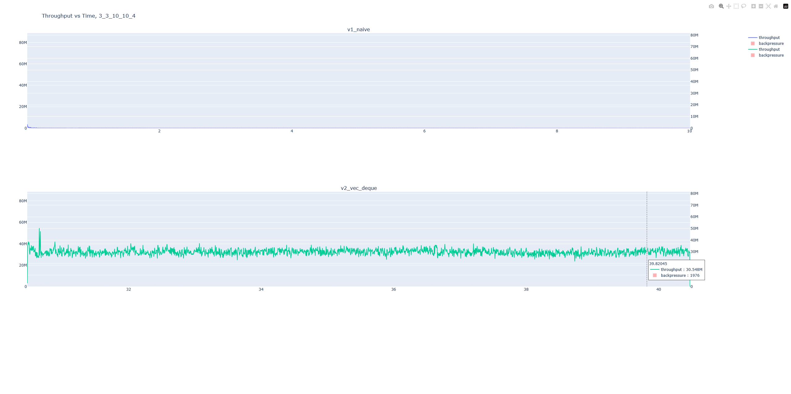
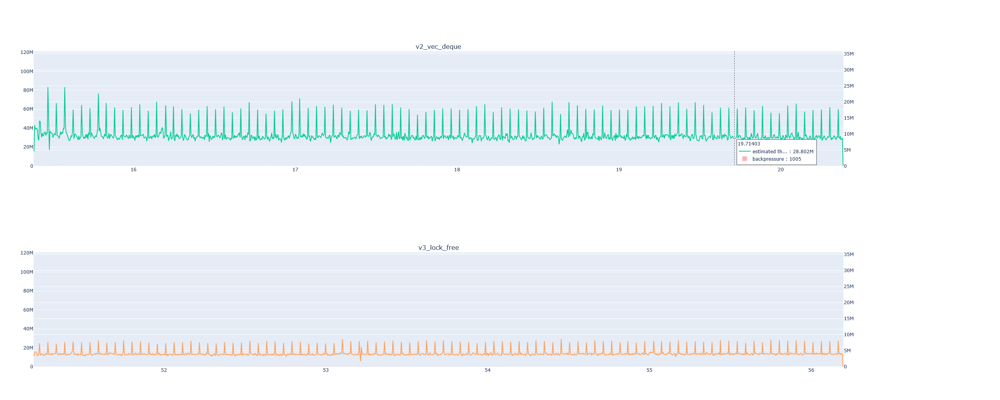
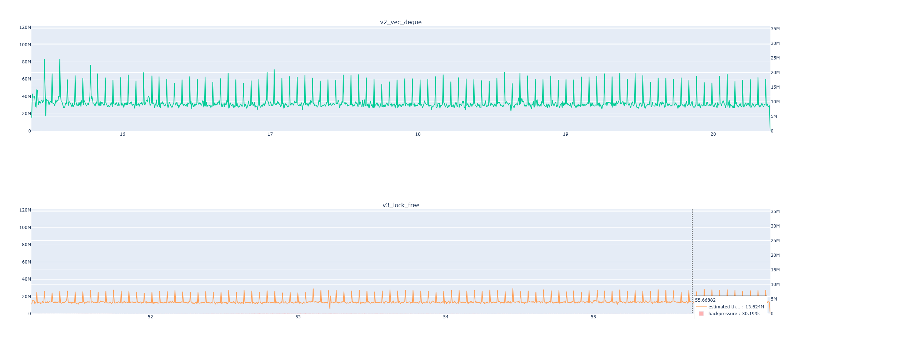

# Multi-Producer, Any-Consumer Channel

An MPMC unbounded concurrent queue accessed through a channel-like API. Has multiple implementations of the queue testing different implemenation techniques.

## Run

`./run.sh bench aggregate plot` or `./run.sh` to run all stages

exclude any arg to only run specified stages

open `output/plots/*.html` to view plots

## Implementations

### Version 1

Implemented as a `Vec`, with sender/receiver count management through `Drop` and `Clone`, safe access through a single `Mutex` and shared with `Arc`. Receivers busy-wait (with `sleep`) until there is an item in the queue, or the queue is empty and the sender count is 0. Senders add to the queue if the receiver count is >0.

### Version 2

Same as version 1, but uses a VecDeque. Basic optimization but results in significantly a significantly better channel.

Throughput in the millions and backpressure hangs around 1000 (check [bench/docs/assets/3_3_10_10_4.html](bench/docs/assets/3_3_10_10_4.html)). 

V1 gets dwarfed in terms of throughput and backpressure:

### Version 3

Implemented as a concurrent linked-list using atomics. Despite being labelled as lock-free, the first iteration basically had 2 spin-locks, one for each end. It performed worse than Version 2 with an equal number of senders and receivers:

However, the throughput was more stable across all tests (check `bench/docs/assets/*.html`, graphics coming soon).

## (WIP) Benchmark

### Benchmark Simulation

#### Test 1

- state: similar/equal to the one in commit `f1516e60c26132f1ace5c772df7b68d71804a11f`
- receivers run until queue is empty
- **run 1** involves 7-1 senders(TTL 5s)-receivers, **run 2** with 1-7
- **run 3** involves 7-1 senders(# requests 100k)-receivers, **run 4** with 1-7

### Benchmark Versions

#### Original (`f1516e60c26132f1ace5c772df7b68d71804a11f`)

- Needed some modifications to allow configuration

- Ran for: `83.7 s`
- Output size: `549 MB`
- Files: `1`
- Avg. \# of Events (with Senders alive for 5 seconds): `~2,487,926` (runs had [`2,516,786`, `2,570,552`, `2,501,010`, `2,521,348`, `2,329,936`])
- \# of Events (with 100k events per Sender): `1,600,036`
- Benchmark overhead (search `BenchRunner`) is `~3.0% or 2500ms` of flamegraph cpu samples
- Benchmark event recording overhead (search `BenchRunner::record`) is `~0.2% or ~170ms` of CPU samples
- Benchmark subject had `~96% or 81000ms` of CPU time (search ``bench.exe`mpac_rs::v1``)

#### Improvement 1 (`4ac7a395f332240c087cc34e66699646f1588d3e`)

- Ran for: `29.9 s`
- Output size: `133 MB`
- Files: `20`
- Avg. \# of Events (with Senders alive for 5 seconds): `~2,023,108` (runs had [`2,002,930`, `2,011,140`, `2,022,838`, `2,033,416`, `2,045,218`])
- \# of Events (with 100k events per Sender): `1,600,036`
- Benchmark overhead (search `BenchRunner`) is `~4.0% or 1200ms` of flamegraph CPU samples
- Benchmark event recording overhead (search `BenchRunner::record`) is `~0.7% or 209ms` of flamegraph CPU samples
- Benchmark subject had `~94% or 28000ms` of CPU time (search ``bench.exe`mpac_rs::v1``)

### Optimizations

#### Easy Wins

- Stopped cloning events, made event struct serializable to avoid conversions
- Writing event data to runner-unique file on `Drop` instead of aggregating them in a "main" runner and writing to one file
- Avoided pretty write

#### Serde

- Used `serde` attribute macros to minify serialization output including:
    - `#[serde(flatten)]`
    - `#[serde(rename = "_extremely_short_name")]`

- Used `serde_repr` to minify enums to `u8`s

- Keeping `serde_json::to_vec` with `File::write_all` turned out to be faster than switching to `serde_json::to_writer` and passing in a `File`, could be due to less syscalls

### Regressions

#### Additional Overhead

`Instant::now` CPU sample % went from `~0.1%` to now `~0.5%`, which could explain the reduction in # of events and rise in overhead.

Instead of storing `Instant`s in events, now storing elapsed seconds from the runner's start time as `f64`. This results in an `Instant::now` call for each event, which explains the rise in `BenchRunner::record`'s proportion of CPU time increasing. This was originally done to reduce the amount of cloning done when a runner exits and writes to value (mapping needed from `Instant` to duration in seconds), but is now being reconsidered.

## (WIP) Aggregator

### Optimizations

Given `13.4 GB` of raw benchmark data,

Went from `400.32s` with the initial implementation,

down to `8.98s` (`44.6x` speedup) with all optimizations.

Speedup 1: Time down to `305.34s`

- Lazily evaluating error string in `LazyWindowedMetric::add` on Option value (using `ok_or_else` instead of `ok_or`) in hot loop

Speedup 2: Time down to `94.60s`

- Sorting aggregation bucket values lazily in `LazyWindowedMetric::generate` 
- Meaning there are no more inserts to each bucket, only pushes
- No longer using sorted values in `LazyWindowedMetric::generate_gauged`

Speedup 3: Time down to `29.70s`

- Vec instead of HashMap for u64 keys
    - Had to update benchmark runner to reset event ids to 0 for each run
- Estimating number of events by summing file sizes then pre-allocating entire vec at the start

Speedup 4, Multithreading, Time down to `8.98s`

- Spawned a thread for each run (version/config pair)