# Multi-Producer, Multi-Consumer Channel

An MPMC unbounded concurrent queue, a custom benchmark engine, and an optimized event aggregator.

Used `Miri` to detect unsoundness and undefined behaviour when using `unsafe`.

Used industry-standard tools like `cargo-flamegraph` resulting in a 44x speedup for the aggregator.

Benchmarked multiple implementations against the unbounded MPMC channel from `crossbeam`.

- Version 1: `Vec<T>` with a `Mutex`
- Version 2: `VecDeque<T>` with a `Mutex`
- Version 3: Linked List with head/tail spinlocks
- Version 4: Resizable Atomic Queue using `Vec<Location<T>>` internally
    - `Location<T>` are reusable slots
    - State management for Readers and Writers (mechanism for gaining exclusivity)

Check out the latest release for result plots.

## Run

`./run.sh bench aggregate plot` or `./run.sh` to run all stages,

exclude any arg to only run specified stages,

open `output/plots/*.html` to view plots.

## Final Implementation (V4) vs Crossbeam's Unbounded MPMC

### Configuration

- 7 senders
- 7 receivers
- 10s TTL for both
- 4 bytes of payload data

*Note: V4 was pre-allocated with a capacity of 50,000,000 items for this benchmark.*

### Throughput

The number of items leaving the channel at the receivers. 

V4 had a slightly better peak throughput at ~13M items/s (compared to 11M items/s for `crossbeam`) which was sustained for most of the 10s that this configuration ran for. 

#### Crossbeam's Unbounded MPMC Channel

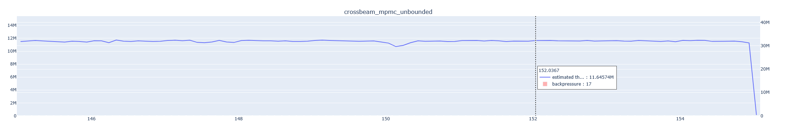

#### V4 - Atomic Array MPMC Channel

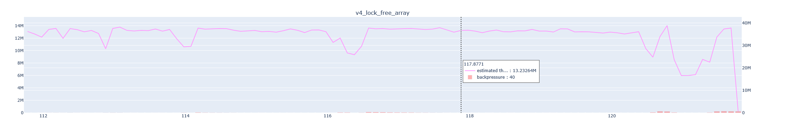

### Latency

How long a single data point takes to enter then leave the channel. 

Shown are *p50*, *p99*, and *p999 (99.9th percentile)* values over time.

#### Crossbeam's Unbounded MPMC Channel

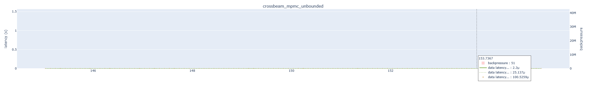

*Stable latency.*

#### V4 - Atomic Array MPMC Channel

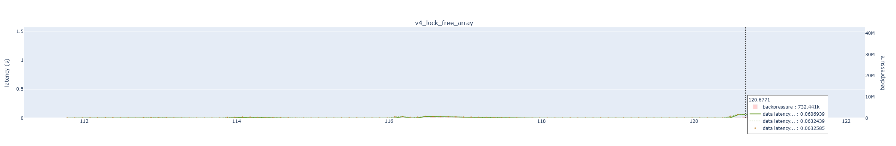

*A notable spike in the median latency to 60ms.*

## Notable Observations

Crossbeam's unbounded MPMC **managed backpressure significantly better** than my V4 implementation in the 3 senders, 1 receiver configuration due to having more throughput.

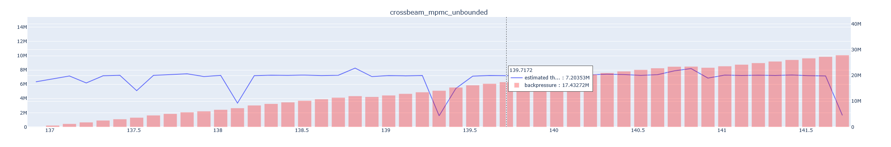
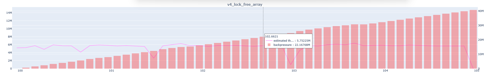

In this configuration, crossbeam's channel was able to produce more throughput and keep backpressure lower. This was due to specific optimizations that reduced cache invalidation and reduced the number of atomic operations needed to push and pop elements.

It was also very memory efficient, it can at most waste the space of a single block, which is typically small, while V4 can be wasting up to 50,000,000 slots worth of space which includes a `Mutex`, `Condvar`, and the size of the item for each slot.

### Crossbeam Implementation

Internally, their unbounded mpmc channel is implemented as a linked-list more comparable to my `V3` channel with some important improvements.

1. Rather than a linked-list of individual nodes, they store blocks of arrays in each node, each containing N slots for a T.

2. Head and Tail pointers are implemented as an atomic pointer into a block and an index. They move through slots and blocks and drop blocks when fully consumed

3. Head and Tail pointers are padded to the size of a cache line since accessing an atomic value invalidates an entire cache line and this way it can avoid invalidating other data.

4. Senders and receivers atomically reserve slots, maybe perform an allocation for a new block and require no synchronization after that

### Conclusion

Due to these optimizations, it's clear why it beats out `V3` (single nodes, long-lived dummy head/tail acting as 2 locks).

It also explains why it beats out `V4` (atomic array). Even when `V4` doesn't have to resize, the `crossbeam` channel does significantly less work to acquire a slot (readers and writers) which results in more throughput, and less backpressure to build up.

#### V4

- Readers and Writers must set their **atomic status flags**
    - This is a synchronization point for whenever a writer needs exclusive access to resize the queue. This overhead is incurred even if no resize is performed.
- Readers and Writers must update the `start` or `end` and the `len` atomic integers on each read/write
- All atomic operations use `Ordering::SeqCst` putting heavy restrictions on instruction re-ordering, resulting in less efficient code

#### Crossbeam

- Atomically reserve a slot or allocate a new block
- Uses less strict atomic ordering requirements
- Uses cache-aware memory layouts for frequently accessed data

## Benchmark

A thread is spawned for each receiver and sender. Senders call `send` as many times as possible and Receivers attempt to `recv` all events in the channel for some number of seconds.

Each event contains:

- Start time
- End time
- Id
- Backpressure

After the benchmark is run, events recorded by senders are matched with ones from receivers and an aggregation is run across all complete and partial (sender/receiver half only) event data.

- Can be found primarily at `bench/src/runner.rs` and `bench/src/test/test_1.rs`

### Optimizations

- Used a raw binary encoding for event files instead of UTF-8
- Tree-like structure for benchmark runners
    - they write to file as soon as a thread is done its work, avoids writing gigabytes of data all at once
    - each thread can record its own events without contending with others

## Aggregator

Collects raw data from the Benchmark and produces useful aggregations such as throughput, send/recv delay values, data latency values, etc. for plotting.

- Can be found primarily at `bench/src/aggregate.rs` and `bench/src/aggregate/metric.rs`

### Optimizations

Given `13.4 GB` of raw benchmark data,

Went from `400.32s` with the initial implementation,

down to `8.98s` (`44.6x` speedup) with all optimizations.

**Speedup 1**: Time down to `305.34s`

- Lazily evaluating error string in `LazyWindowedMetric::add` on Option value (using `ok_or_else` instead of `ok_or`) in hot loop

**Speedup 2**: Time down to `94.60s`

- Sorting aggregation bucket values lazily in `LazyWindowedMetric::generate` 
- Meaning there are no more inserts inside each bucket, only pushes at their ends
- No longer using sorted values in `LazyWindowedMetric::generate_gauged` (was only necessary to find percentiles)

**Speedup 3**: Time down to `29.70s`

- Vec instead of HashMap for u64 keys
    - Had to update benchmark runner to reset event ids to 0 for each run
- Estimating number of events by summing file sizes then pre-allocating entire vec at the start

**Speedup 4**, Multithreading, Time down to `8.98s`

- Spawned a thread for each run (version/config pair)

## Overall Results

### Configuration

- 3 Senders
- 3 Receivers
- 5s TTL
- 4 byte payload

### Version 1

Implemented as a `Vec`, safe access through a single `Mutex` and shared with `Arc`. Receivers pop using `remove(0)` and busy-wait (with `sleep`) until there is an item in the queue, or the queue is empty and the sender count is 0. Senders add to the queue if the receiver count is >0.

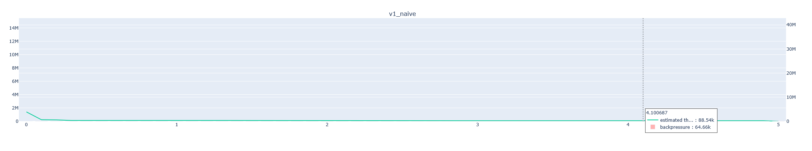

*Throughput stable around 90k items/s*

### Version 2

Uses a VecDeque instead of a Vec and is guarded by a Mutex. Basic optimization but results in a significantly better channel.

V1 gets dwarfed in terms of throughput and backpressure:

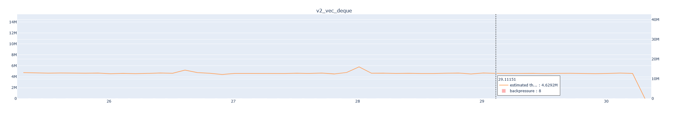

*Throughput stable around 4.5M items/s*

#### Optimization

`remove(0)` for `Vec` shuffles every element back and returns the first element. This operation was O(n). 

`VecDeque` maintains a ring buffer which, instead of one length field, stores a start and end. This way, removing an element using `pop_front` from the front involves an addition and moduluo operation and is O(1).

### Version 3

Implemented as a concurrent linked-list using atomics. Despite being labelled as lock-free, the first iteration basically had 2 spin-locks, one for each end. It performed worse than Version 2 with an equal number of senders and receivers:

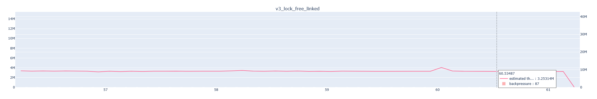

*Throughput stable around 3.2M items/s*

However, it did perform better with the `1 Sender, 3 Receivers` configuration:

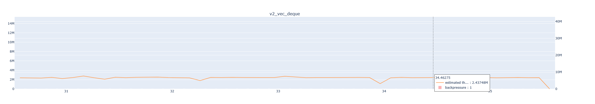

*Throughput stable around 2.4M items/s for V2*

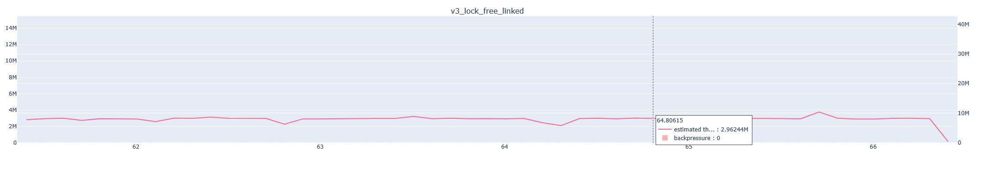

*Throughput stable around 2.9M items/s for V3*

#### Version 3 Structure and Explanation

V3 has a spinlock at the front, and at the back while V2 has a single central lock. In V3, readers and writers don't often contend with each other for a channel that has enough elements, while the V2 implementation has persistent contention between readers and writers.

To push an element, a writer has to **reserve the last 2 nodes** (in an empty list, this would be the `dummy_front` and `dummy_back` marker nodes).

To pop an element, a reader has to **reserve the first 3 nodes** (assuming there's a node to pop):

- The `dummy_front` node
- Node to be taken (if it exists)
- Node after it (may be the `dummy_back` node)

As long as the linked-list is large enough (size >= 5), these nodes never overlap and writers don't contend with readers (they may still wait between themselves).

In V2, a single `Mutex` is used and all writers and readers contend with each other.

We can look at the delay plots for evidence of this in effect:

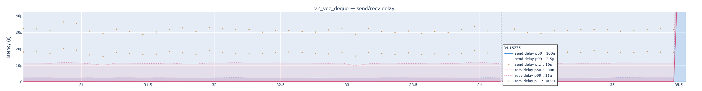

*99th percentile Send delay hangs around 2.5 microseconds. 99.9th percentile at 16 microseconds*

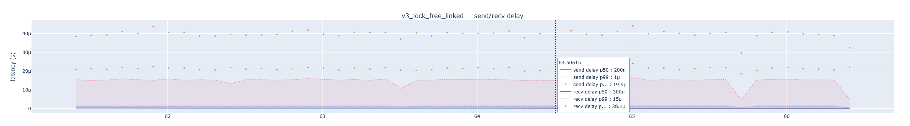

*99th percentile Send delay hangs around 1 microsecond. 99.9th percentile at 20 microseconds*

This means that V3 spends less overall time sending requests and can perform more sends than V2. We have an excess of receivers and as long as at least one receiver is making progress on receiving, we can assume that faster sends will lead to a higher throughput. This explains the longer 99.9th percentile figures, as backpressure rarely built up and this results in the linked list having a length less than the critical length of 5 where no send-recv contention occurs.

### Version 4

Implemented as a concurrent array using atomics. To meet the requirement of being unbounded, a mechanism for re-allocating the array was created.

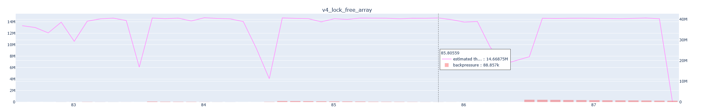

*Throughput unstable but hangs around 14.6M items/s for most of the run*

#### Reallocation

A mechanism for re-sizing the underlying buffer while concurrent accesses are occurring.

The first few senders that attempt to push to a filled slot request a buffer re-allocation (`Action::ResizeRequested`). Senders attempt to take control of the reallocation through an atomic status flag (`Status::WaitingToResize`) and one successful sender becomes responsible for it. This sender waits for all other senders and receivers to finish their current task, force them to temporarily stop their operations through another atomic flag `Action::ExternallyBlocked`. Once exclusivity is established, a new buffer is allocated and all old data is copied over.

### Crossbeam

Implemented as a linked-list of blocks, each with a constant number of slots that can each hold an item.

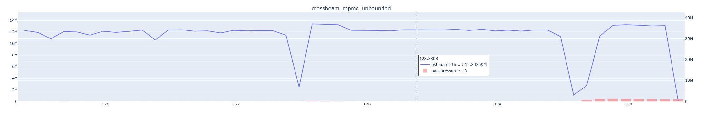

*Throughput unstable but hangs around 12.3M items/s for most of the run*

#### Lower Throughput

Crossbeam's channel can be observed to have lower throughput than V4 for most of the run. Backpressure, latency, and delay patterns were similar between the two. 

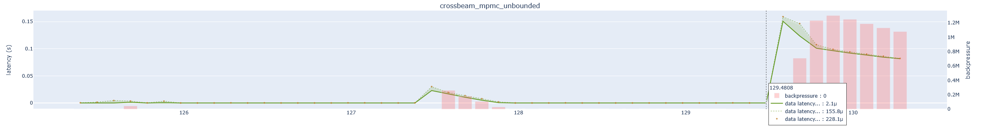

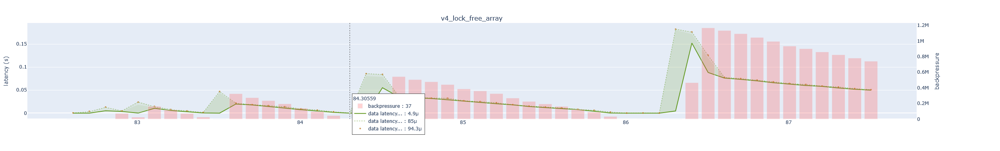

A likely explanation is Crossbeam's conservative allocation strategy. Crossbeam's allocates small blocks when needed and drops old blocks when they've been used. This allocation is performed on sends only and this can also explain why backpressure values are always low. Senders simply cannot keep up with an equal number of receivers due to that extra work.

#### Recv Delays

Crossbeam's recv delays vary more than V4 and tails are often longer:

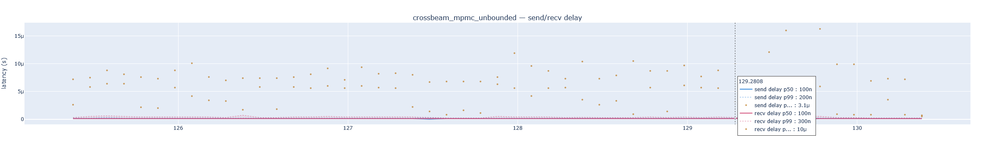

*Crossbeam 99.9th percentile recv delays go past 8 microseconds about half the time*

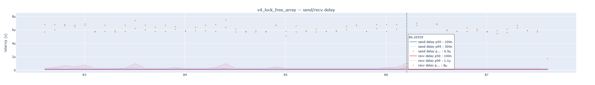

*V4 99.9th percentile recv delays peak at 8 microseconds*

Crossbeam recv calls implement a backoff mechanism using `std::thread::yield_now`. It yields control back to the operating system's scheduler, which can decide to reschedule the thread at any time. This may result in a larger variance and longer tails for recv operations due to scheduler unpredictability. 

This occurs most notably when no elements are available to pop and backpressure values get closer to single digits, which is when backoff mechanisms kick in.
